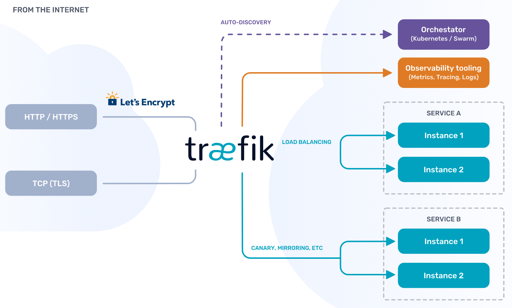

<!-- PROJECT LOGO -->
<br />
<p align="center">
  <a href="https://github.com/github_username/repo">
    
  </a>

  <h3 align="center">This is a repo of my settings and my experiences</h3>

  <p align="center">
    <a href="https://docs.traefik.io/"><strong>Explore the office docs »</strong></a>
    <br />
    <br />
    <a href="https://github.com/containous/traefik/">Official Github</a>
    ·
    <a href="https://containo.us/traefik/">Traefik EE</a>
    ·
    <a href="https://github.com/containous/traefik/issues">Office Issues</a>
  </p>
</p>

<!-- TABLE OF CONTENTS -->
## Index

* [Prerequisites](#prerequisites)
* [Important notes](#important-notes)
* [Traefik non TlS simple installation](#traefik-non-tls-simple-installation)
  * [Software version](#software-version)
  * [Traefik Configs](#traefik-configs)
* [Traefik non TlS simple installation with basic auth](#traefik-non-tls-simple-installation-with-basic-auth)
  * [Software version](#software-versions)
  * [Traefik Configs](#traefik-configs-with-basic-auth)
* [Traefik non TlS simple installation with basic auth and subpath](#traefik-non-tls-simple-installation-with-basic-auth)
  * [Software version using subpath](#software-versions-usign-in-subpath)
  * [Traefik Configs with subpath configs](#traefik-configs-with-subpath-configs)
* [Traefik with TLS](#traefik-with-tls)
  * [Software version](#softwares-versions)
  * [Traefik file description](#traefik-file-description)
  * [Traefik Configs with TLS](#traefik-configs-with-tls)
* [Traefik TLS with Authelia](#traefik-tls-with-authelia)
  * [Software version](#softwares-versions-all)
  * [Traefik file description](#traefik-files-description)
  * [Authelia Users Config](#authelia-users-config)
  * [Traefik Configs with Authelia](#traefik-configs-with-authelia)
* [Traefik TLS with Authelia and consul](#traefik-tls-with-authelia-and-consul)
  * [Software version](#softwares-versions-with-consul)
  * [Traefik file description](#traefik-files-descriptions)
  * [Traefik Configs with Consul](#traefik-configs-with-consul)
* [Traefik TLS, Authelia and consul with metrics using prometheus](#traefik-tls-authelia-and-consul-with-metrics-using-prometheus)
  * [Software version](#softwares-versions-with-metrics)
  * [Traefik file description](#traefik-file-description-with-metrics)
  * [Traefik Configs with Metrics](#traefik-configs-with-metrics)

# Configuration for the application of Traefik 2.2.x

<p align="center">
    <br />
    <br />
    
    <br />
</p>
Traefik is the leading open source reverse proxy and load balancer for HTTP and TCP-based applications that is easy, dynamic, automatic, fast, full-featured, production proven, provides metrics, and integrates with every major cluster technology... No wonder it's so popular!

The following settings shown here can be used as a guide to be able to **Traefik version 2.X** in multiple possible scenarios, these scenarios have been tested in the ***dev environment*** and in the ***home-self project*** so if you want to deploy  Traefik in production environment please follow the official documentation provided by the developer, without further ado the description of my settings.

<!-- PREREQUISITES  -->
### Prerequisites

* [Docker = v.19.03.12 or higher](https://docs.docker.com/engine/install/)
* [Docker-Compose = v.1.25.0-rc4 or higher](https://docs.docker.com/compose/install/)

<!-- IMPORTANT NOTES  -->
### Important notes

There are a few things that we are going to make clear from the beginning, all the settings shown here will have the same pattern so it is better to clarify them at the beginning so that there is no confusion about it.

* All settings are in YML Files.
* A docker compose per project was used to deploy all the necessary components for its operation.
* Port expose instead of port so that **traefik** can interpret and identify to which port traffic should redirect.
* Use the minimum lines in the docker compose ***(I hate docker-compose files with long amounts of lines)***.
* All repositories use an environment file please rename that file to ***.env***.
* For all the configurations it is necessary to have a docker network called ***proxy***, it can be created easily by executing the following command
```
$ docker network create proxy
```
* In order to execute any of the configurations the following this command 
```
docker-compose up -d
```
or if you only want to run a single container
```
docker-compose up -d NAME_OF_SERVICE_TO_DECLARE_THE_CONTIANER
```

<!-- TRAEFIK NON TLS SIMPLE INSTALATION  -->
## Traefik non TlS simple installation
 In this section we can find a fairly simple **Traefik configuration** just using port 80 to be able to enter, using only the docker provider to read the elements executed in the same node that bring the instructions to use traefik.

### Software version
* Traefik = `v2.2.1` Official website [Link](https://docs.traefik.io/)
* Portainer = `1.25.5` Official website [Link](https://www.portainer.io/installation/)
* Whoami = `latest`

### Traefik Configs
 1. In order to **traefik** you can read that the container has instructions to be read, it must be enabled for its proper reading with the following instruction.
```
- traefik.enable=true
```
 2. The containers that are going to be used by **traefik** must be in the same network or **traefik** must know this network so that communication can take place.

 3. As the containers are within the same network as **traefik**, it is not necessary to publish the ports with the command expose **traefik** automatically knows to which port the traffic must be redirected, with this we avoid having to create a service rule and tRaefik generates it for us from automatic way
```
    expose:
      - PORT NUMBER
```
<!-- TRAEFIK NON TLS SIMPLE INSTALATION WITH BASIC AUTH  -->
## Traefik non TlS simple installation with basic auth
In this section we can find a small variation to our configuration which adds a new concept for version 2 of **traefik** which is what is known as middleware to know more read the following [Link](https://docs.traefik.io/middlewares/overview/),the variation that we add is that there is some level of restriction in order to be able to access the dashboard using one predefine user, we can do the following.

In the file `traefik_config/configurations/middlewares.yml` there is a predefined user change it using the following website [Generate your user and password](https://www.web2generators.com/apache-tools/htpasswd-generator)


### Software versions
* Traefik = `v2.2.1` Official website [Link](https://docs.traefik.io/)
* Portainer = `1.25.5` Official website [Link](https://www.portainer.io/installation/)
* Whoami = `latest`

### Traefik Configs with basic auth
 1. We use the same configurations that we saw in the last configuration.
 2. The only change we have is that in the docker-compose commands we add the middleware so that **traefik** can enter using the new login we just created
 ```
 - traefik.http.routers.traefik-http-mdw.middlewares=user-auth@file
 ```
 3. Additionally we create a service so that you can use the GUI without having to open any additional port
 ```
  - traefik.http.routers.traefik-http-svc.service=api@internal
 ```

 <!-- TRAEFIK NON TLS SIMPLE INSTALATION WITH BASIC AUTH AND SUBPATH  -->
## Traefik non TlS simple installation with basic auth and subpath
This section is to show a configuration with a slightly different change to the one we have been working on instead of using subdomain we will use **subpath**, this is to use the same domain but using different path to enter different applications.

In the file `traefik_config/configurations/middleware-http.yml` there is a predefined user change it using the following website [Generate your user and password](https://www.web2generators.com/apache-tools/htpasswd-generator)

Here is an example of what the configuration looks like.:

<p align="center">
    <br />
    <br />
    
    <br />
</p>

### Software versions usign in subpath
* Traefik = `v2.2.1` Official website [Link](https://docs.traefik.io/)
* Portainer = `1.25.5` Official website [Link](https://www.portainer.io/installation/)
* MariaDB = `10.4.13` Official website [Link](https://downloads.mariadb.org/)
* PhpmyAdmin = `5.0.2` Official website [Link](https://www.phpmyadmin.net/)
* Whoami = `latest`

### Traefik Configs with subpath configs
1. All the configuration uses only port 80, **it is not necessary** to use an exclusive port to enter the dashboard of bringsfik example 8080.
2. The docker-compose file has two different ways of defining the settings, one is in the case of the container whoami that carries the definition of the subpath and the other is the declaration of a complement of route rule.
3. the suar subpath is necessary to add a / to the end of the url for it to work in this way that aggregation is done automatically using middlewares.
4. **Traefik** supports that we make chains of our middlewares so that we can use them in groups in our case we use one to work which we call **middlewares-chain.yml**, very important note the middlewares must be created to refer to the chain, for more information you can consult the [Official documentation](https://docs.traefik.io/middlewares/chain/).
5. Using this label the docker container will not appear in the settings of traefik.
```
- traefik.enable=false
```
<!-- TRAEFIK WITH TLS -->
## Traefik with TLS
In this section we are going to start using tls using a free service called Let's Encrypt which we are going to store in a json file for more information read the following [article](https://docs.traefik.io/https/acme/).A very important note is that both the ports for the **http protocol** and for the **https protocol** must be redirected to the node that is running **traefik** with tls otherwise it will not work.

### Softwares versions
* Traefik = `v2.2.1` Official website [Link](https://docs.traefik.io/)
* Portainer = `1.25.5` Official website [Link](https://www.portainer.io/installation/)
* Whoami = `latest`

### Traefik file description
 1. **Acme File** as part of a requirement, this file must have permission 0600 so that it can work to **traefik**. In this file all our certificates will be stored for each domain we use.
 ```
$ sudo chmod 0600 ./traefik_config/acme/acme.json
 ```
### Traefik Configs with TLS
 1. We use the same configurations that we saw in the last configuration.
 2. Add one more middleware to redirect the entrypoint https
 3. In this configuration the containers have a double declaration to solve the fact that some user does not put the https to enter
 ```
       ## http Routers Rules
      - traefik.http.routers.portainer-http-rtr.rule=Host(`portainer.$DOMAINNAME`)
      - traefik.http.routers.portainer-http-rtr.entrypoints=http
      ## Middlewares Rules
      - traefik.http.routers.portainer-http-rtr.middlewares=middlewares-https-redirect@file
      ## https Routers Rules
      - traefik.http.routers.portainer-https-rtr.rule=Host(`portainer.$DOMAINNAME`)
      - traefik.http.routers.portainer-https-rtr.entrypoints=https
      - traefik.http.routers.portainer-https-rtr.tls=true
      - traefik.http.routers.portainer-https-rtr.tls.certresolver=letsencrypt
```
In this example we can see how a route is created to enter through the http entrypoint but it redirects to https using middleware, and in the https configuration we declare which certificate to resolve we are going to use for said services since multiple tls can be declared resolvers in the settings of **traefik**.
 4. In the file of ***traefik.yml*** we make the declaration of our certificate of letsencrypt
 5. In the declaration of our file provider we can declare this ***( watch: true )*** function which gives us the ability to create, modify, delete or update files that are located in the selected folder,**without the need to restart our traefik**
 ```
   file:
    directory: /configurations/
    watch: true
  ```  
<!-- TRAEFIK TLS WITH AUTLELIA -->
## Traefik TLS with Authelia 
In this section we are going to use **traefik** using tls but adding a separate authentication software, this software is called ***Authelia*** and you can enter the link shown in the software versions, which provides us with a single login or a double authentication in any of our services depending on our level of requirement, it should be noted that using mariadb and redis is completely optional for the use of it, so if you do not want to use it, you can comment on it in the configuration file.

Here is a brief diagram of what the configuration looks like:
<p align="center">
    <br />
    <br />
    
    <br />
</p>

### Softwares versions all
* Traefik = `v2.2.1` Official website [Link](https://docs.traefik.io/)
* Authelia = `4.18.1` Official website [Link](https://www.authelia.com/docs/)
* MariaDB = `10.4.13` Official website [Link](https://downloads.mariadb.org/)
* PhpmyAdmin = `5.0.2` Official website [Link](https://www.phpmyadmin.net/)
* Redis = `latest` Official website [Link](https://redis.io/)
* Portainer = `1.25.5` Official website [Link](https://www.portainer.io/installation/)
* Dozzle = `v1.22.3` Official website [Link](https://dozzle.dev/)
* Whoami = `latest`

### Traefik files description
Adding this Authelia software change  our file distribution a little bit , remembering that all the files that we put in the configuration folder will be automatically updated in our file.
1. Recommendation **traefik** in version 2.x incorporates the distribution of its components in
```
- Routes
- Middlewares
- services
```
Reason why I recommended to put each one of these separately so that its maintenance is easier,knowing that **http** and **tcp** are handled now, so 1 huge file could cause chaos and complications in the future,so create separate files identifying them with the corresponding protocol.
```
- routes-http.yml
- routes-tcp.yml
---------------------
- middlewares-http.yml
- middlewares-tcp.yml
----------------------
- services-http.yml
- services-tcp.yml
```
2. We can also create a file for our own TLS as shown in the example calling it **tls.yml**. [Official documentation](https://docs.traefik.io/https/tls/).
3. **Traefik** supports that we make chains of our middlewares so that we can use them in groups in our case we use one to work with authelia which we call **middlewares-chain.yml**, very important note the middlewares must be created to refer to the chain, for more information you can consult the [Official documentation](https://docs.traefik.io/middlewares/chain/).

### Authelia Users Config
For the creation of the users Authelia  allows two forms of authentication, one by using text file and the other using  LDAP, in our case we are going to use the one of the file.

Having said that, there are two ways to generate a new password:
1. Docker Generator [Official documentation](https://www.authelia.com/docs/configuration/authentication/file.html).
```
$ docker run authelia/authelia:VERSION authelia hash-password yourpassword
Password hash: $argon2id$v=19$m=65536$3oc26byQuSkQqksq$zM1QiTvVPrMfV6BVLs2t4gM+af5IN7euO0VB6+Q8ZFs
```
2. Using online Website with Ramdom Generator, for this second method take into account the following factors:
  * it is necessary to have the master token to be configured in the configuration file, which can be generated with this [Link](https://www.grc.com/passwords.html).
  * Once having this link we can generate our password on this [site](https://argon2.online/), the algorithm that is used Authelia is the ***Argon2id***.
  * Create the new user with the generated password, restart the container and  trying to login to the new user.

**Note =** if the user does not enter there is a possibility that the wrong password will be generated, check all the steps again and try again.

### Traefik Configs with authelia
 1. We use the same configurations that we saw in the last configuration.
 2. Add one more middleware to redirect the entrypoint https and one to use authelia config.
 3. New middleware chain that references two at the same time
 4. The new configuration that we add to our containers to use Emplelia is the following:
 ```
       ## Middlewares Rules
      - traefik.http.routers.traefik-rtr.middlewares=chain-authelia@file
 ```
  Where we refer to the chain that we create.

<!-- TRAEFIK TLS WITH AUTLELIA AND CONSUL -->
## Traefik TLS with Authelia and consul
In this section it is practically the same as the previous one with the difference that a new provider is added to the backend of **traefik** which is ***consul catalog*** which will allow to register all the services that are discovered new in consul, something important that in this repo no show any configuration for consul.

Here is a brief diagram of what the configuration looks like:
<p align="center">
    <br />
    <br />
    
    <br />
</p>

### Softwares versions with consul
* Traefik = `v2.2.1` Official website [Link](https://docs.traefik.io/)
* Authelia = `4.18.1` Official website [Link](https://www.authelia.com/docs/)
* MariaDB = `10.4.13` Official website [Link](https://downloads.mariadb.org/)
* PhpmyAdmin = `5.0.2` Official website [Link](https://www.phpmyadmin.net/)
* Redis = `latest` Official website [Link](https://redis.io/)
* Portainer = `1.25.5` Official website [Link](https://www.portainer.io/installation/)
* Dozzle = `v1.22.3` Official website [Link](https://dozzle.dev/)
* Whoami = `latest`

In this repo no other configuration is shown that is not from **Traefik** but this configuration was tested with the following softwares
* Consul = `1.7.3` Official website [Link](https://www.consul.io/)
* Registrator = `master` Official website [Link](https://gliderlabs.com/registrator/latest/)

### Traefik files descriptions
* The only thing that changes here is that we add a new provider to the static configuration file of **traefik**, for the update of this it is necessary to restart the container of **traefik**. [Link](https://docs.traefik.io/routing/providers/consul-catalog/) 
* In case the consul I have the ACL mode it is necessary declare in the docker compose in the enviroment part the corresponding token so that **traefik** can read the services consult.
```
     environment:
       - "CONSUL_HTTP_TOKEN=CONSUL_ACL_FOR_TRAEFIK"
```

### Traefik Configs with consul
 1. We use the same configurations that we saw in the last configuration.
 2. Add one more middleware to redirect the entrypoint https and one to use authelia config.
 3. New provider Consul Catalog.

<!-- TRAEFIK TLS  AUTLELIA AND CONSUL WITH METRICS USING PROMETHEUS  -->
## Traefik TLS Authelia and consul with metrics using prometheus
For this section we use authelia and also use consul,so we need a little monitoring to know what is happening through our **traefik**, thanks to the fact that it has a monitoring feature, we incorporate prometheus into our config to know what is happening.[Link](https://docs.traefik.io/observability/metrics/prometheus/) 

Here is a brief diagram of what the configuration looks like:
<p align="center">
    <br />
    <br />
    
    <br />
</p>

### Softwares versions with metrics
* Traefik = `v2.2.1` Official website [Link](https://docs.traefik.io/)
* Authelia = `4.18.1` Official website [Link](https://www.authelia.com/docs/)
* MariaDB = `10.4.13` Official website [Link](https://downloads.mariadb.org/)
* PhpmyAdmin = `5.0.2` Official website [Link](https://www.phpmyadmin.net/)
* Redis = `latest` Official website [Link](https://redis.io/)
* Portainer = `1.25.5` Official website [Link](https://www.portainer.io/installation/)
* Dozzle = `v1.22.3` Official website [Link](https://dozzle.dev/)
* Cadvisor = `v0.33.0` Official website [Link](https://github.com/google/cadvisor)
* Node Exporter= `v1.0.0` Official website [Link](https://prometheus.io/docs/guides/node-exporter/)
* Whoami = `latest`

In this repo no other configuration is shown that is not from **Traefik** but this configuration was tested with the following softwares
* Consul = `1.7.3` Official website [Link](https://www.consul.io/)
* Registrator = `master` Official website [Link](https://gliderlabs.com/registrator/latest/)
* Prometheus = `v2.19.0` Official website [Link](https://prometheus.io/)
* Grafana = `7.0.3` Official website [Link](https://grafana.com/)


### Traefik file description with metrics
 * For our configuration file, add in our static files the section referring to the metrics of prometheus.
 * So must also create a new entrypoint so that the metrics work correctly.
 * The port must be declared in the docker-compose so that there are no problems.
 * The respective configuration must be created in prometheus so that it reads the metrics generated by **traefik**. [Link](https://prometheus.io/docs/prometheus/latest/configuration/configuration/)

### Traefik Configs with metrics
 1. We use the same configurations that we saw in the last configuration.
 2. Add one more middleware to redirect the entrypoint https and one to use authelia config.
 3. New metrics are sent to prometheus for respective monitoring.